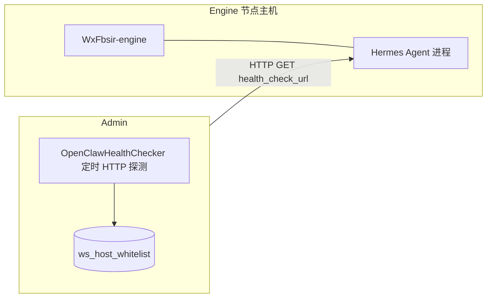

# Hermes Agent 部署于 Engine 侧并与 Admin 主机纳管集成 — 技术方案

> **状态**：**阶段 A 已落地**（Admin 定时/手动 HTTP 健康检查 + 前端类型 Hermes）；任务编排见 §6 后续。  
> **目标**：将 **Hermes Agent** 作为与 **OpenClaw Gateway** 类似的**旁路执行器**，部署在 **Engine 节点同机（或同网络就近）**，并在 **Admin** 侧通过现有 **主机白名单** 能力完成登记、健康状态与运维视图；后续再演进任务编排与调用链。  
> **版本**：2026-04

---

## 1. 背景与目标

### 1.1 现状（代码基线）

- **Engine**：`WxFbsir-engine` 通过 **WebSocket** 连接 Admin（`/ws/engine`），`host_id` 在 **`ws_host_whitelist`** 中登记，类型为 **`engine`**。  
- **OpenClaw**：不作为本仓库内进程；在 **`ws_host_whitelist`** 中类型为 **`openclaw`**，填写 **`health_check_url`**，由 **`OpenClawHealthChecker`** 定时 **HTTP GET**，**2xx** 更新 **`online_status`**。  
- **手动健康检查接口**：已支持 **`openclaw`** 与 **`hermes`**（与定时任务类型一致）。

### 1.2 目标

| 维度 | 说明 |
|------|------|
| 部署 | Hermes Agent **安装在 Engine 侧**（推荐同机 localhost；亦可同子网固定 IP） |
| 纳管 | Admin **主机白名单** 中可登记 Hermes 对应记录，**类型区分**于 engine / openclaw |
| 健康 | 与 OpenClaw **同模式**：可配置的 **HTTP 健康 URL**，定时探测 **online/offline** |
| 执行器定位 | 与 OpenClaw 类似：**先纳管可达性**，**任务下发 / 回调**在后续阶段定义（见 §6） |

### 1.3 非目标（本方案不强制规定）

- Hermes 的具体开源仓库、CLI 名称、默认端口（由选型落地时写入配置与种子数据）。  
- 与腾讯元器 / 企微等业务流的深度绑定（可作为后续「能力」对接项）。

---

## 2. 架构设想

### 2.1 逻辑关系

- **Hermes** 与 **Engine** 同机部署时，`health_check_url` 典型为：`http://127.0.0.1:{hermes_http_port}/health`（或官方提供的 health/metrics 路径）。  
- Admin **不直接**连 Engine 的 HTTP 来推断 Hermes；**以 Hermes 自身暴露的 HTTP 为准**（与 OpenClaw 一致），避免 Engine 与 Hermes 进程强耦合。

### 2.2 与 OpenClaw 的对比

| 项目 | OpenClaw | Hermes（本方案） |
|------|----------|------------------|
| 进程归属 | 独立 Gateway，常单独端口 | **计划部署在 Engine 侧** |
| 纳管类型 | `host_type=openclaw` | 建议 **`host_type=hermes`** |
| 健康检查 | HTTP GET `health_check_url` | **同左** |
| WebSocket 注册 | 无（非 Engine） | **无**（Hermes 非 Engine 协议） |
| host_id 含义 | 仅业务标识，不参与 WS 鉴权 | **建议**：业务标识 + 与 Engine 节点 **运维绑定**（见 §4） |

---

## 3. 数据模型与约定

### 3.1 复用表 `ws_host_whitelist`

- **无需新增表**；沿用字段：  
  - **`host_id`**：唯一键，建议命名规范：`hermes-{engineHostId}` 或 `hermes-{机房}-{序号}`，避免与真实 Engine 的 `host_id` 冲突。  
  - **`host_type`**：新增枚举值 **`hermes`**（与 `engine`、`openclaw` 并列）。  
  - **`health_check_url`**：Hermes 的 HTTP 健康检查地址（必填）。  
  - **`online_status`**：`online` / `offline`。  
  - **`status`**：启用/禁用。

### 3.2 数据库与脚本

- **MySQL**：若当前仅依赖应用层字符串，**无 DDL 变更**即可插入 `host_type='hermes'`。  
- 若需约束：可增加 **CHECK** 或应用层校验白名单（`engine|openclaw|hermes`）。  
- 提供 **增量 SQL**（`sql/update_xxx_hermes_host_type说明.sql`）：可选注释 + 文档化，**不强制改表结构**。

### 3.3 与 Engine 白名单的关系

- **`engine`** 类型行：对应 **WebSocket 接入** 的 Engine 实例（`host_id` 在 WS 握手使用）。  
- **`hermes`** 类型行：**不参与** WebSocket 鉴权；仅用于 **HTTP 健康检查** 与展示。  
- **同一物理机** 可同时存在：  
  - 一条 `engine`（`host_id=engine-dev-001`）  
  - 一条 `hermes`（`host_id=hermes-engine-dev-001`，`health_check_url=http://127.0.0.1:端口/health`）

---

## 4. Admin 侧改造范围（建议分阶段）

### 4.1 阶段 A：纳管 + 健康检查（与 OpenClaw 对齐）— **已落地**

| 模块 | 实现说明 |
|------|----------|
| Mapper | selectHostsForHttpHealthCheck()：host_type IN ('openclaw','hermes')，del_flag=0 且 status=1 |
| 定时任务 | **`OpenClawHealthChecker`**（类名未改），**30s**，GET、5s 超时、2xx → `online` |
| Controller | `manualHealthCheck`：`openclaw` / `hermes` 可调 |
| 前端 | `host/whitelist/index.vue`：类型 **Hermes**、标签与「健康检查」按钮 |

### 4.2 阶段 B：体验与运维

- 列表页 **按类型筛选**、**在线状态** 角标与 **Hermes 版本**（若健康接口 JSON 返回 version，可异步增强展示，可选）。  
- 日志：健康检查失败日志带 **`host_id`** 与 **URL**，便于排查防火墙 / 端口。  
- 权限：复用现有 `business:host:whitelist:*`；若需细粒度，可增加 `hermes` 专用权限（可选）。

---

## 5. Engine 侧与 Hermes 部署

### 5.1 部署形态

| 方式 | 说明 |
|------|------|
| **同机进程** | Engine JAR + Hermes 二进制/容器，**health_check_url** 使用 `127.0.0.1` |
| **同机 Docker** | Hermes 容器映射端口到宿主机，URL 指向宿主机端口 |
| **进程守护** | Windows：NSSM / 任务计划；Linux：systemd |

### 5.2 网络与安全

- 仅 **Admin 能访问** 的 Hermes 端口时：需 **内网** 或 **VPN**；或 Admin 通过 **同网段** 访问 Engine 宿主机 IP。  
- **不建议** 将无鉴权 Hermes 暴露公网；若 Hermes 支持 **Token**，可在后续方案中扩展 **HTTP Header**（需改 `RestTemplate` 调用，**非阶段 A 必需**）。

### 5.3 与 Engine 进程的协作（后续）

- 阶段 A **不要求** Engine 代码感知 Hermes。  
- 阶段 C（可选）：Engine 内 **HTTP 客户端** 调用 Hermes 执行任务（见 §6），或 **仅 Admin 经 Engine 转发**。

---

## 6. 执行器能力与后续演进（建议路线图）

### 6.1 阶段 A（本方案核心）

- **纳管 + HTTP 健康**，与 OpenClaw **同等级**。

### 6.2 阶段 B：任务与路由

- **方案 B1**：Admin → **已有 Engine WebSocket** → Engine 调 **Hermes 本地 API** → 结果经 Engine 回 Admin。  
- **方案 B2**：Admin → **REST** 直连 Hermes（需网络与安全策略），Engine 仅同机部署无调用关系。  
- **方案 B3**：Hermes **回调** Admin Webhook（`business` 模块新增回调接口 + 签名校验）。

### 6.3 与「主机」绑定展示

- 在 UI 上 **关联** `engine` 的 `host_id` 与 `hermes` 的 `host_id`（可选字段或约定前缀），便于运维一眼看到「某 Engine 节点上的 Hermes」。

---

## 7. 风险与依赖

| 风险 | 缓解 |
|------|------|
| Hermes 健康路径不统一 | 落地时以 **官方文档** 为准，在 `health_check_url` 填完整路径 |
| Admin 无法访问 127.0.0.1 | 健康 URL 必须填 **Admin 视角可达** 地址（如 Engine 宿主机 **内网 IP**） |
| 与 OpenClaw 代码重复 | 阶段 A 可接受复制；**中期** 合并为 `GenericHttpHostHealthChecker(types)` |
| host_id 命名冲突 | 规范前缀 **`hermes-`**，与 Engine 的 `engine-*` 区分 |

---

## 8. 验收标准（阶段 A）

1. 在 **`ws_host_whitelist`** 中可新增 **`host_type=hermes`**，并保存 **`health_check_url`**。  
2. Admin 定时任务对 Hermes 记录执行 HTTP 检查，**`online_status`** 随探测结果更新。  
3. **手动健康检查** 接口对 `hermes` 类型 **可用**（与 openclaw 行为一致）。  
4. 文档中给出 **部署示例**（端口占位、URL 示例）与 **故障排查** 清单。

---

## 9. 文档与交付物

- 本方案：`docs/方案/Hermes-Agent与主机纳管集成方案.md`  
- 说明 SQL：`sql/update_20260414_hermes主机纳管说明.sql`（无 DDL，示例 INSERT 已注释）  
- 功能说明：`docs/功能说明/business功能/OpenClaw主机纳管功能说明.md`（已补充 Hermes 类型说明）

---

## 10. 修订记录

| 日期 | 版本 | 说明 |
|------|------|------|
| 2026-04 | 0.1 | 初稿：基于现有 OpenClaw 纳管模式与 `ws_host_whitelist` 扩展 |
| 2026-04 | 0.2 | 阶段 A 落地：Mapper/定时任务/Controller/前端；说明 SQL 见 `sql/update_20260414_hermes主机纳管说明.sql` |

---

## 11. 相关文档

- **[Hermes Agent 安装可行性评估](./Hermes-Agent安装可行性评估.md)**：本机安装验证、Windows 与官方支持路径、Gateway HTTP 探测待办。

---

## 12. 实施记录（阶段 A）

- **后端**：`WsHostWhitelistMapper#selectHostsForHttpHealthCheck`，`OpenClawHealthChecker` 查询 OpenClaw + Hermes；`HostWhitelistController#manualHealthCheck` 允许 `hermes`。  
- **前端**：主机白名单页增加 Hermes 类型展示与手动健康检查。  
- **数据库**：无 DDL；可选示例见 **`sql/update_20260414_hermes主机纳管说明.sql`**。
