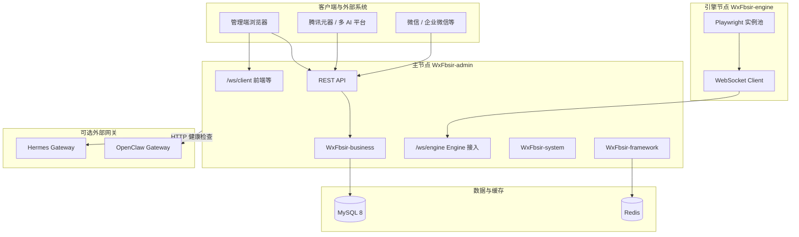

# 福帮手数据智能化系统（WxFbsir）白皮书

> **文档性质**：面向 **决策层、产品运营、实施交付、研发测试、合作伙伴及学习者** 的 **全维度** 介绍，与 `README.md`、`部署文档.md`、`docs/` 专题文档互为补充。  
> **品牌口径**：中文正式名 **福帮手数据智能化系统**；简称 **福帮手 FBSir**；技术标识 **WxFbsir**（详见 `docs/全局一致性对齐说明.md`）。  
> **版本口径**：主干工程 **1.0.0**；Engine 节点 **1.3.1**（`WxFbsir-engine/pom.xml` 中 `engine.version`）。  
> **文档日期**：2026 年 4 月

---

## 如何使用本文档（按读者）

| 读者类型 | 建议阅读章节 | 目的 |
|----------|----------------|------|
| **决策者 / 投资人** | [§1 品牌与愿景](#一品牌愿景与定位)、[§2 价值](#二核心价值)、[§4 场景](#四典型场景与价值闭环)、[§11 风险](#十一风险合规与约束) | 快速判断方向、差异化与合规边界 |
| **产品 / 运营 / 市场** | [§1](#一品牌愿景与定位)、[§3](#三产品能力全景)、[§4](#四典型场景与价值闭环)、[§12 术语](#十二附录术语与常见问题) | 能力边界、话术素材、落地场景 |
| **实施 / 运维 / 交付** | [§5 架构](#五总体架构)、[§9 部署](#九部署扩展与运维路径)、[§8 安全运维](#八安全运维与数据治理)、[§10 文档](#十文档体系与延伸阅读) | 拓扑、端口、配置入口、排障索引 |
| **架构师 / 后端 / 前端** | [§5](#五总体架构)、[§6](#六技术与工程结构)、[§7](#七数据集成与主机纳管)、[§10](#十文档体系与延伸阅读) | 模块划分、技术栈、集成点 |
| **安全 / 合规** | [§8](#八安全运维与数据治理)、[§11](#十一风险合规与约束) | 认证、审计、开源协议影响 |
| **初次接触开源项目的读者** | [§1](#一品牌愿景与定位)、[§4](#四典型场景与价值闭环)、[§12](#十二附录术语与常见问题) | 建立心智模型，再按需深入 |

---

## 一、品牌、愿景与定位

### 1.1 一句话与品牌

- **一句话**：福帮手是面向企业与团队运营场景的 **AI 工具链与智能协同平台**，把内容生产、自动化、多 AI 平台、积分与权限等能力 **统一纳管** 在一套可扩展架构中。  
- **品牌句**：**福帮手FBSir，幸福有AI，幸运有你。**（英文：**Fbsir, AI 4 Happiness, U 4 Fortune.**）  
- **社会价值表述**（与仓库 `README` 一致）：以 AI 工具链赋能团队建设，推动智能原生企业更快涌现，助力智能社会高质量发展。

### 1.2 使命与边界

- **使命**：降低多模型、多平台、多流程的协同成本，让团队 **用得起、管得住、扩得开** 智能化能力。  
- **不做单一写作工具**：福帮手强调 **流程、治理与扩展**——与仅提供对话或单点写作的产品互补而非替代。  
- **开源形态**：项目以 **AGPL-3.0** 开源（见根目录 `LICENSE`）；若基于本项目修改并通过网络提供服务，须遵守 AGPL 对衍生作品开源的要求（详见 [§11](#十一风险合规与约束)）。

### 1.3 定位矩阵

| 维度 | 福帮手的回答 |
|------|----------------|
| **与「仅大模型对话」产品** | 提供 **业务编排、权限、积分、多节点协同**，而非单一聊天框 |
| **与 RPA/脚本工具** | 通过 **Engine + Playwright** 与主节点 **WebSocket 协议** 协同，可审计、可白名单 |
| **与纯 SaaS** | 可 **私有化部署**，源码可审计；能力模块可按团队阶段启用 |

---

## 二、核心价值

| 价值 | 说明 |
|------|------|
| **效率** | 多模型并行生成、文档解析、公众号链路、工作流编排，缩短从创意到交付的路径 |
| **可运营** | 积分、统计、角色权限，支撑商业化与内部运营策略 |
| **可扩展** | Engine 侧 **能力（Capability）注册** 扩展任务类型；业务按包域划分，便于演进 |
| **可治理** | 主机白名单、连接日志、HTTP 健康检查（OpenClaw / Hermes 等），运维可观测 |
| **企业向** | Spring Security、JWT、验证码、操作日志；支持私有化与内网部署 |

---

## 三、产品能力全景

以下为 **能力域** 级梳理，便于产品与业务对齐；实现细节以代码与专题文档为准。

| 能力域 | 用户可感知的能力 | 说明（关键词） |
|--------|------------------|----------------|
| **内容生产** | 日更助手、多模型协同、排版与优化 | AIGC 框架、会话与结构化输出物（能力随版本迭代） |
| **公众号与微信生态** | 草稿箱投递、素材、发布记录 | 微信公众号配置与 API 集成 |
| **文档与知识** | 文档解析、知识库、同步到元器/企微 | 异步任务、多格式解析 |
| **协作与机器人** | 企业微信智能机器人、消息与 Webhook | `airobotmessage` 等模块 |
| **自动化与元器** | 浏览器自动化、工作流节点、截图与任务 | Engine + Playwright，WebSocket 与 Admin 协同 |
| **人才与认证** | 面试助手、简历与短链、认证易（证书） | 业务包 `interviewbot`、`resume`、`certificate` |
| **开发者与开源画像** | Gitee 登录与能力分析 | `gitee` 包 |
| **系统治理** | 用户角色菜单、定时任务、监控入口 | 若依体系扩展 + Quartz |
| **积分与商业化基础** | 积分规则、消耗拦截 | `point` 包 |
| **主机纳管** | Engine / OpenClaw / Hermes 在线状态 | 白名单 + HTTP 健康检查 / WebSocket 注册 |

> **说明**：上表为 **能力地图**，非接口清单；接口与表结构见 `docs/api/API接口文档.md` 与 `sql/`。

---

## 四、典型场景与价值闭环

### 4.1 内容运营团队

**场景**：日更、多风格初稿、审稿与发布。  
**闭环**：日更助手 → 多模型产出 → 优化合成 →（可选）公众号草稿 → 发布记录追踪。  
**福帮手侧价值**：统一账号与权限、可配置积分与审计。

### 4.2 需要浏览器自动化的业务

**场景**：需在真实浏览器中登录、导航、截图、对接元器或内部系统。  
**闭环**：Admin 登记 Engine 主机 → Engine 通过 **WebSocket** 注册 → 下发自动化任务 → 截图/结果回传。  
**福帮手侧价值**：白名单与连接日志，避免「无人值守脚本」失控。

### 4.3 企业微信内协同

**场景**：群内机器人、模板消息、与业务系统联动。  
**闭环**：配置 Webhook/机器人 → 消息进入业务模块 → 与积分、权限策略联动。  
**福帮手侧价值**：与企业微信能力对齐的模块化管理。

### 4.4 私有化与合规敏感团队

**场景**：数据不出域、需审计与角色隔离。  
**闭环**：私有化部署 MySQL/Redis → 内网 Admin → 可选仅内网 Engine。  
**福帮手侧价值**：开源可审计；须同时评估 **AGPL 义务**（见 §11）。

---

## 五、总体架构

### 5.1 逻辑架构

### 5.2 进程与端口（默认开发环境）

| 组件 | 默认端口 | 说明 |
|------|----------|------|
| WxFbsir-admin | **8080** | HTTP，`server.port` |
| WxFbsir-ui（Vite 开发） | **5173** | 代理 `/dev-api` → Admin |
| WxFbsir-engine | **8081** | Engine HTTP，含 Actuator |
| OpenClaw Gateway（可选） | **18789**（示例） | 独立进程，白名单填 `health_check_url` |
| Hermes Gateway（可选，常见 WSL/Linux） | **8642**（API Server） | `API_SERVER_ENABLED=true` 时 `/health` |
| MySQL | **3306** | 库名默认 `wxfbsir` |
| Redis | **6379** | 缓存、Token、验证码等 |

### 5.3 与若依（RuoYi）的关系

后台管理基于 **若依（RuoYi）** 体系二次开发（用户、角色、菜单、日志等模式延续），业务在 `WxFbsir-business` 大幅扩展 AIGC、WebSocket、积分等，已超出标准若依模板范畴。

---

## 六、技术与工程结构

### 6.1 技术栈摘要

| 层级 | 技术 | 说明 |
|------|------|------|
| **后端（主工程）** | Java **17**、Spring Boot **3.5.4**（BOM）、MyBatis、MySQL **8.2.x**、Druid、Redis、Quartz、SpringDoc **2.8.9**、Fastjson2 | 见根 `pom.xml` 与 `WxFbsir-admin` |
| **后端（Engine）** | Spring Boot **3.3.6**（Engine 自有 BOM）、Playwright **1.49.0**、Java-WebSocket **1.5.7**、Actuator | 独立构建，`wxfbsir-engine-[engine.version].jar` |
| **前端** | Vue **3**、Vite、Element Plus、Pinia、Vue Router、Axios | `WxFbsir-ui` |

### 6.2 仓库与模块

- **根 `pom.xml`**：`com.wx.fbsir:WxFbsir:1.0.0`，`packaging=pom`，聚合后端子模块（**不包含** `WxFbsir-engine` 与 `WxFbsir-ui`）。其中 **不聚合 `WxFbsir-engine` 属于主副节点架构的刻意划分**（主工程 Admin / 副节点 Engine），而非遗漏。  
- **`WxFbsir-engine`**：独立 Maven 工程，**同仓独立构建**；构建与测试在 `WxFbsir-engine` 目录执行，与根 reactor 分轨。  
- **`WxFbsir-ui`**：前端工程，独立 `package.json`。

**Maven 子模块职责（摘要）**

| 模块 | 职责 |
|------|------|
| WxFbsir-admin | Web 入口、主启动类、控制器与主配置 |
| WxFbsir-framework | Security、Redis、MyBatis、拦截器等 |
| WxFbsir-system | 用户、角色、菜单、部门、日志等系统域 |
| WxFbsir-common | 通用工具、常量、异常等 |
| WxFbsir-business | AIGC、公众号、积分、文档解析、WebSocket 业务等 |
| WxFbsir-quartz | 定时任务 |
| WxFbsir-generator | 代码生成器 |

**Engine 包结构（摘要）**：`capability`（能力注册）、`playwright`（浏览器池与截图）、`websocket`（与主节点协议）等。

---

## 七、数据、集成与主机纳管

### 7.1 数据层

- 初始化脚本在 **`sql/`**：主文件 **`wxfbsir.sql`**；**`quartz.sql`**；另有 **`update_*.sql`** 增量脚本。  
- 连接配置：**`WxFbsir-admin/.../application-druid.yml`**，支持环境变量 **`WXFBSIR_MYSQL_*`**。  
- **编码**：JDBC 与连接初始化须与 **utf8mb4** 一致，避免中文乱码（见 `docs/全局一致性对齐说明.md`）。

### 7.2 Redis

用于验证码、Token、缓存、限流等；配置 `spring.data.redis`，支持 **`WXFBSIR_REDIS_*`**。

### 7.3 主机白名单与 HTTP 纳管（OpenClaw / Hermes）

- 表 **`ws_host_whitelist`**：`host_type` 为 **`engine` / `openclaw` / `hermes`**，配合 **`health_check_url`**、**`online_status`**。  
- **Engine**：`host_id` + WebSocket 注册与白名单校验。  
- **OpenClaw / Hermes**：定时/手动 **HTTP GET** 探测 URL，**2xx** 视为在线；管理端支持导出与手动探测接口（详见 API 文档与功能说明）。

---

## 八、安全、运维与数据治理

### 8.1 认证与权限

- **Spring Security** + **JWT** + 验证码；菜单与接口级权限。  
- **Engine**：主机 ID 白名单、IP 黑名单、限流、连接日志。

### 8.2 WebSocket 路径约定

- Engine 接入：**`ws://{admin}/ws/engine`**，与 `wxfbsir.websocket.path` 一致，**不可随意更改**（否则 Engine 与截图上传路径会失配）。

### 8.3 运维建议（摘要）

- 生产环境替换默认密钥、数据库与 Redis 密码；限制 Druid 控制台暴露。  
- Engine 与 Playwright 占用内存显著，按机器规格调整实例池与并发。  
- 日志与监控：结合 Actuator、业务日志与主机在线状态。

---

## 九、部署、扩展与运维路径

### 9.1 关键配置入口

| 文件 | 用途 |
|------|------|
| `WxFbsir-admin/.../application.yml` | 端口、Redis、域名、WebSocket 等 |
| `WxFbsir-admin/.../application-druid.yml` | 数据源 |
| `WxFbsir-engine/.../application.yml` | `ws-url`、`host-id`、Playwright；**工程策略见文件头（禁止依赖环境变量读取业务配置）** |
| `WxFbsir-ui/.env.*` | 前端环境变量（部分可能未入库，需按环境自建） |

### 9.2 构建与运行（摘要）

- 主工程：`mvn clean package -DskipTests`，运行 Admin 或对应 JAR。  
- Engine：在 `WxFbsir-engine` 目录打包，运行 **`wxfbsir-engine-1.3.1.jar`**；首次需安装 Playwright 浏览器（见 `WxFbsir-engine/README.md`）。  
- 前端：`npm install`、`npm run dev` / `npm run build:prod`。

### 9.3 辅助脚本

仓库 **`tools/`** 下提供 MySQL、Engine、OpenClaw、Hermes（WSL）等辅助脚本，**仅缩短本机开发路径，非生产强制依赖**。

---

## 十、文档体系与延伸阅读

| 入口 | 内容 |
|------|------|
| `README.md` | 项目介绍、快速开始、版本口径 |
| `项目结构说明.md` | 目录树与模块说明 |
| `部署文档.md` | 部署与元器工作流 |
| `docs/README.md` | 文档中心导航 |
| `docs/api/API接口文档.md` | 接口索引 |
| `docs/全局一致性对齐说明.md` | 文档与代码口径 |
| `docs/功能说明/` | 各业务专题说明 |
| `WxFbsir-engine/README.md` | Engine 专项 |

---

## 十一、风险、合规与约束

1. **AGPL-3.0**：网络服务形态需提供符合协议的源码开放策略；使用前请法务评估。  
2. **密钥与凭据**：禁止在生产使用默认 Token、弱密码；妥善保管公众号、企微、第三方 API 密钥。  
3. **Engine 资源**：Playwright 与并发强相关，低配环境须调参。  
4. **版本差异**：主工程与 Engine 的 Spring Boot 小版本可能不同，升级需分别回归。  
5. **外部产品**：OpenClaw、Hermes 等为 **独立项目**，本仓库通过 **集成与纳管** 使用，其许可与安全策略需单独遵循。

---

## 十二、附录：版本索引、术语与常见问题

### 12.1 版本与产物索引

| 项 | 值 |
|----|-----|
| 父工程版本 | 1.0.0 |
| Spring Boot（父 BOM） | 3.5.4 |
| Engine Spring Boot | 3.3.6 |
| Engine 版本（`engine.version`） | 1.3.1 |
| Engine JAR 文件名模式 | `wxfbsir-engine-[engine.version].jar` |
| 前端 package name/version | WxFbsir / 1.0.0 |

### 12.2 术语表（简）

| 术语 | 解释 |
|------|------|
| **Admin / 主节点** | WxFbsir-admin，Web 与业务编排入口 |
| **Engine / 引擎节点** | WxFbsir-engine，跑 Playwright，经 WebSocket 连 Admin |
| **WxFbsir** | 项目技术标识与包前缀 |
| **OpenClaw / Hermes** | 可选外部 AI 网关类产品；本系统通过白名单 + HTTP 健康检查纳管 |
| **若依（RuoYi）** | 后台管理基础框架，本项目在其上深度扩展业务 |

### 12.3 常见问题（非技术读者）

**问：福帮手和「一个大模型网页」有什么区别？**  
答：福帮手提供 **后台治理**（权限、积分、任务、多节点），并把 **公众号、企微、自动化引擎** 等串成可运营流程，而不是单次对话。

**问：数据存在哪里？**  
答：默认架构下业务数据在 **自建 MySQL**；私有化部署时数据留在客户环境，具体取决于部署方式与配置。

**问：为什么要 Engine 节点？**  
答：需要 **真实浏览器**、长会话或与内部页面交互时，由 Engine 执行；Admin 负责调度与审计。

**问：开源是否意味着没有服务支持？**  
答：开源提供源码与文档；商业支持、定制与培训取决于项目维护方或合作伙伴政策（以实际为准）。

---

**文档维护**：本文随主干版本迭代；若与 `README.md`、`pom.xml` 或代码冲突，以 **代码与构建文件** 为最终事实来源（Code as Source of Truth）。
