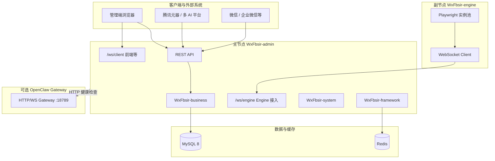

# 福帮手数据智能化系统（WxFbsir）项目白皮书

> **文档性质**：面向技术负责人、架构师与核心开发者的项目级说明，与仓库内 `README.md`、`项目结构说明.md`、`部署文档.md` 及 `docs/` 下专题文档互为补充。  
> **版本口径**：主干工程 **1.0.0**（根 `pom.xml`、`WxFbsir-ui/package.json`）；Engine 节点 **1.3.1**（`WxFbsir-engine/pom.xml` 中 `engine.version`）。  
> **文档日期**：2026 年 4 月

---

## 一、执行摘要

**福帮手数据智能化系统**（对外品牌可称 **WxFbsir / 微信福帮手**）是一套面向企业与团队运营场景的 **AI 工具链与智能协同平台**。系统在架构上采用 **主节点（Admin）+ 引擎节点（Engine）+ 可选外部网关（如 OpenClaw Gateway）** 的组合：主节点负责 Web 管理、鉴权、业务编排与持久化；引擎节点通过 **WebSocket** 接入主节点，承载 **Playwright** 浏览器自动化与任务执行；**OpenClaw** 类主机则通过 **HTTP 健康检查** 纳入主机纳管视图。

技术形态为 **Spring Boot 3.x 多模块后端** + **Vue 3 + Vite 前端**，数据层以 **MySQL 8** 为主、**Redis** 用于会话与缓存等能力，协议层包含 **REST**、**WebSocket** 及与 **腾讯元器、企业微信** 等外部平台的集成。

**开源协议**：**GNU Affero General Public License v3.0（AGPL-3.0）**（见仓库根目录 `LICENSE`）。若基于本项目修改并通过网络提供服务，须遵守 AGPL 对衍生作品开源的要求。

---

## 二、产品定位与目标用户

### 2.1 定位

- **统一纳管**：将内容生产、文档解析、公众号投递、工作流智能体、多 AI 平台、积分与权限等能力集中在一套后台与可扩展的 Engine 能力框架内。  
- **可运营**：积分、统计、角色权限等支撑商业化与内部运营。  
- **可扩展**：Engine 侧以「能力（Capability）」注册机制扩展新任务类型；业务侧按领域划分模块。

### 2.2 典型用户

- 需要 **多模型内容生产**、**公众号运营**、**文档解析** 的团队。  
- 需要 **浏览器自动化**（Playwright）与主节点协同的运维或自动化场景。  
- 需要 **主机白名单、连接审计、OpenClaw 健康监控** 的管理员。

---

## 三、总体架构

### 3.1 逻辑架构

### 3.2 进程与端口（默认开发环境）

| 组件 | 默认端口 | 说明 |
|------|----------|------|
| WxFbsir-admin | **8080** | HTTP，`server.port` |
| WxFbsir-ui（Vite 开发） | **5173**（若已改为非 80） | 代理 `/dev-api` → Admin |
| WxFbsir-engine | **8081** | Engine 自带 HTTP，含 Actuator |
| OpenClaw Gateway（可选） | **18789** | 官方 CLI，与种子库 `host_id=test` 健康 URL 对齐 |
| MySQL | **3306** | 库名默认 `wxfbsir` |
| Redis | **6379** | 缓存、Token、验证码等 |

### 3.3 与若依（RuoYi）的关系

后台管理基于 **若依（RuoYi）** 体系二次开发（用户、角色、菜单、日志等模式延续），业务层在 `WxFbsir-business` 大幅扩展 AIGC、WebSocket、积分等能力，已超出标准若依模板范畴。

---

## 四、技术栈

### 4.1 后端（主工程 Maven）

| 类别 | 技术 | 说明 |
|------|------|------|
| 语言与构建 | Java **17**、Maven | 父 POM `java.version` |
| 核心框架 | Spring Boot **3.5.4**（父 BOM） | `WxFbsir-admin` 等模块 |
| ORM | MyBatis **3.x** + PageHelper |  |
| 持久化 | MySQL Connector **8.2.x** |  |
| 连接池 | Druid **1.2.23** | `spring-boot-3-starter` |
| 任务调度 | Quartz | `WxFbsir-quartz` |
| API 文档 | SpringDoc OpenAPI **2.8.9** | Swagger UI |
| JSON | Fastjson2 **2.0.58** |  |
| 安全 | Spring Security + JWT（jjwt） | 见 `WxFbsir-framework` |
| 验证码 | Kaptcha |  |

### 4.2 后端（Engine 独立模块）

| 类别 | 技术 | 说明 |
|------|------|------|
| Spring Boot | **3.3.6**（Engine 自有 BOM） | 与主工程版本 intentionally 可略有差异 |
| 浏览器自动化 | Playwright Java **1.49.0** | Chromium 等 |
| WebSocket 客户端 | Java-WebSocket **1.5.7** | 连接 Admin |
| 健康检查 | Spring Boot Actuator | `/actuator/health` 等 |
| 产物名 | `wxfbsir-engine-1.3.1.jar` | `engine.version=1.3.1` |

### 4.3 前端

| 类别 | 技术 | 说明 |
|------|------|------|
| 框架 | Vue **3.5.x** |  |
| 构建 | Vite **6.3.x** |  |
| UI | Element Plus **2.10.x** |  |
| 状态 | Pinia **3.x** |  |
| 路由 | Vue Router **4.5.x** |  |
| HTTP | Axios |  |

---

## 五、仓库与模块结构

### 5.1 根目录与父工程

- **根 `pom.xml`**：`com.wx.fbsir:WxFbsir:1.0.0`，`packaging=pom`，聚合下列模块（**不包含** `WxFbsir-engine` 与 `WxFbsir-ui`）。  
- **`WxFbsir-engine`**：独立 Maven 工程，与主工程 **同一仓库** 但 **独立构建**。  
- **`WxFbsir-ui`**：Node 前端工程，独立 `package.json`。

### 5.2 Maven 子模块职责

| 模块 | 职责 |
|------|------|
| **WxFbsir-admin** | Web 入口、`WxFbsirApplication`、控制器、静态资源与主配置 |
| **WxFbsir-framework** | Security、Redis、MyBatis、拦截器、切面等框架层 |
| **WxFbsir-system** | 用户、角色、菜单、部门、日志等系统域 |
| **WxFbsir-common** | 注解、常量、工具、通用异常与 XSS 等 |
| **WxFbsir-business** | 核心业务：AIGC、公众号、积分、文档解析、WebSocket、Gitee 等 |
| **WxFbsir-quartz** | 定时任务 |
| **WxFbsir-generator** | 代码生成器 |

### 5.3 业务包（`com.wx.fbsir.business`）一级划分

| 包名 | 方向 |
|------|------|
| `aigc` | AIGC 框架与多模型协同相关 |
| `airobotmessage` | 企业微信智能机器人消息与推送 |
| `certificate` | 认证易（证书申请与审核等） |
| `dailyassistant` | 日更助手 |
| `documentparse` | 文档解析助手 |
| `gitee` | Gitee 用户能力与开源数据分析 |
| `interviewbot` | 面试助手 |
| `knowledgebase` | 知识库 |
| `nodeeditwithstrategy` | 节点编辑与策略管理 |
| `officialaccount` | 微信公众号草稿与素材等 |
| `point` | 积分系统 |
| `resume` | 简历助手与短链等 |
| `systemprompt` | 系统提示词与 Webhook |
| `websocket` | Engine/Client WebSocket、白名单、连接日志、OpenClaw 健康检查 |

### 5.4 Engine 模块（`com.wx.fbsir.engine`）

| 区域 | 说明 |
|------|------|
| `capability` | `@OnceCapability` / `@StreamCapability` 注解与能力注册 |
| `controller` | 含 `demo` 演示能力、元器/业务控制器等 |
| `playwright` | 浏览器池、会话、截图上传客户端 |
| `websocket` | 与主节点的消息协议与连接管理 |

### 5.5 前端目录要点

- `src/api`：按 `business` / `system` / `monitor` / `tool` 划分。  
- `vite.config.js`：开发环境将 **`/dev-api`** 代理到后端（默认 `http://localhost:8080`）。

---

## 六、数据与中间件

### 6.1 MySQL

- 初始化脚本位于 **`sql/`**：主文件 **`wxfbsir.sql`**；**`quartz.sql`** Quartz 表；另有 **`update_*.sql`** 增量脚本。  
- 典型库名：**`wxfbsir`**。  
- 连接配置：**`WxFbsir-admin/.../application-druid.yml`**，支持环境变量 **`WXFBSIR_MYSQL_URL` / `USERNAME` / `PASSWORD`**。

### 6.2 Redis

- 配置在 **`application.yml`** 的 `spring.data.redis`。  
- 用于：登录验证码、Token、重复提交拦截、限流等（见 `WxFbsir-framework` 中 `RedisCache` 等用法）。  
- 支持环境变量 **`WXFBSIR_REDIS_*`**。

### 6.3 主机白名单与 HTTP 纳管（OpenClaw / Hermes）

- 表 **`ws_host_whitelist`**（见增量脚本）：字段含 **`host_type`**（`engine` / `openclaw` / `hermes`）、**`health_check_url`**、**`online_status`** 等。  
- **Engine**：使用 `host_id` 与 **WebSocket 注册** 绑定，由 `WhitelistService` 等校验。  
- **OpenClaw / Hermes**：由 **`OpenClawHealthChecker`**（`selectHostsForHttpHealthCheck`：`openclaw` / `hermes`）定时 **HTTP GET** 访问 `health_check_url`，**2xx** 视为在线；管理端提供列表 CRUD、**`POST /business/host/whitelist/export`** 导出、**`GET .../health-check/{id}`** 手动探测。

---

## 七、通信与安全

### 7.1 WebSocket 路径

- **Engine 接入**：`ws://{admin}/ws/engine`（路径与 `application.yml` 中 `wxfbsir.websocket.path` 一致，**不可随意改**）。  
- **客户端/前端**：`/ws/client` 等（见 `WebSocketConfig` 与文档）。

### 7.2 安全机制

- **Spring Security**：登录、权限注解、菜单权限。  
- **JWT**：`token.header`、`token.secret`、`expireTime`（见 `application.yml`）。  
- **验证码**：数学/字符验证码，依赖 Redis。  
- **Engine 连接**：主机 ID 白名单、IP 黑名单、限流、连接日志（见 `EngineWebSocketHandler`、`WhitelistService`）。

---

## 八、外部集成与能力边界

### 8.1 已文档化的集成方向

- **腾讯元器**、工作流 ZIP 导入（见 `docs/workflows/`、`部署文档.md`）。  
- **微信公众号**：草稿、素材等（`officialaccount`）。  
- **企业微信**：智能机器人（`airobotmessage`、Engine 侧配置说明）。  
- **Gitee**：OAuth 与能力分析（`gitee`）。  
- **文档解析 / MCP**：见 `docs/功能说明` 下专题说明。

### 8.2 OpenClaw

- **OpenClaw** 本身为 **独立开源产品**（官方 CLI / Gateway），本仓库 **不包含** OpenClaw 源码。  
- 本系统通过 **白名单 + 健康 URL** 将其纳入 **主机纳管**；默认网关端口在文档与种子数据中常出现 **18789**。

---

## 九、配置、部署与运维

### 9.1 关键配置文件

| 文件 | 用途 |
|------|------|
| `WxFbsir-admin/.../application.yml` | 端口、Redis、MyBatis、域名、WebSocket 开关等 |
| `WxFbsir-admin/.../application-druid.yml` | 数据源与 Druid 控制台 |
| `WxFbsir-engine/.../application.yml` | `ws-url`、`host-id`、Playwright 池、**禁止依赖环境变量**（工程策略见文件头注释） |
| `WxFbsir-ui/.env.*` | 前端环境变量（部分可能被 `.gitignore` 忽略，需按环境自建） |

### 9.2 构建与运行

- **主工程**：`mvn clean package -DskipTests`，运行 `WxFbsir-admin` 模块或 `java -jar` 对应产物。  
- **Engine**：在 `WxFbsir-engine` 目录 `mvn clean package -DskipTests`，运行 **`wxfbsir-engine-1.3.1.jar`**；首次需安装 Playwright 浏览器（见 `WxFbsir-engine/README.md`）。  
- **前端**：`npm install`、`npm run dev` / `npm run build:prod`。

### 9.3 文档与脚本

- **部署与元器**：`部署文档.md`。  
- **故障排查**：`docs/运行维护/`、`docs/功能说明/engine/`。  
- **本机辅助脚本**（若存在）：仓库 `tools/` 下 `env.ps1`、`start-mysql.ps1`、`start-engine.ps1`、`start-openclaw.ps1` 等用于缩短 Windows 开发路径，**非生产强制依赖**。

---

## 十、文档体系与延伸阅读

| 入口 | 内容 |
|------|------|
| `README.md` | 项目介绍、快速开始、版本口径 |
| `项目结构说明.md` | 目录树与模块说明 |
| `部署文档.md` | 完整部署与元器工作流 |
| `docs/README.md` | 文档中心导航 |
| `docs/api/API接口文档.md` | 接口索引 |
| `docs/全局一致性对齐说明.md` | 文档与代码口径一致 |
| `WxFbsir-engine/README.md` | Engine 开发指南 |

---

## 十一、风险与约束

1. **AGPL-3.0**：网络服务形态需提供符合协议的源码开放策略。  
2. **密钥与凭据**：生产环境须替换默认 Token、数据库密码、Redis 密码等，并限制 Druid 控制台暴露。  
3. **Engine 资源**：Playwright 实例与内存、CPU 强相关，低配置环境需调小 `instance-pool` / `pool`。  
4. **版本差异**：主工程与 Engine 的 Spring Boot 小版本号可能不同，升级时需分别验证。

---

## 十二、附录：版本与产物索引

| 项 | 值 |
|----|-----|
| Maven 父工程 `artifactId` | WxFbsir |
| 父工程版本 | 1.0.0 |
| Spring Boot（父 BOM） | 3.5.4 |
| Engine Spring Boot | 3.3.6 |
| Engine 版本（`engine.version`） | 1.3.1 |
| Engine 可执行 JAR 文件名 | `wxfbsir-engine-1.3.1.jar` |
| 前端 `package.json` name/version | WxFbsir / 1.0.0 |

---

**文档维护**：本文随主干版本迭代更新；若与 `README.md` 或 `pom.xml` 冲突，以 **代码与构建文件** 为准。
